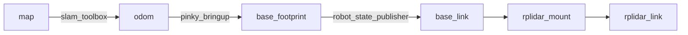

# 실물 Pinky TF 및 주행 구조 점검

2026-09-07, SSH `pinky-pro`, 실제 실행 그래프와 소스 기준.

## 현재 확인한 TF

- `/odom`은 `odom` frame, `base_footprint` child, 발행자는 pinky_bringup 하나.
- 동적 odometry TF는 표본 종료 시 약 28ms 전 값이었다.
- `base_footprint -> base_link`는 z=0.028m 고정 변환.
- `base_link -> rplidar_link` 합성은 (-0.017, 0, 0.097)m, yaw=180도.
- 최근 LiDAR 10표본 모두 측정 timestamp에서 odom 및 map TF 조회 성공.
- static TF의 오래된 timestamp는 정상이며 동적 TF 만료와 구분해야 한다.
- slam_toolbox의 /tf endpoint 2개가 발견됐지만 실행 프로세스는 하나였다.
  endpoint 수만으로 동일 edge의 중복 발행 충돌이라고 결론 내리지 않았다.
- 이 결과는 TF 연결성과 시간 조회 증거다. 실제 바닥의 위치 오차 검증은 아니다.

## 불일치 및 구현 공백

1. TF LiDAR yaw=180도, 안전 센서 계산 및 웹 polar view의 nose=190도.
   같은 센서 각도를 SLAM과 장애물 판단이 10도 다르게 해석한다.
   실측 nose=190도가 맞다면 TF yaw 대응값은 +170도(-190도)다.
   기계 장착과 센서 방향을 검증하기 전 어느 한 숫자를 임의로 바꾸지 않는다.
2. 기존 웹은 odom을 map에 직접 표시했다. 앞선 배포에서 map<-odom을 적용했지만
   오래된 TF/odom 유효성 및 실제 base_link 기준 표시까지 보완이 필요하다.
3. 기존 goal_node는 TF 실패 시 odom을 map으로 간주했다. 이번 로컬 변경에서
   이 대체 경로를 제거하고 지도/TF가 없거나 만료되면 경로를 취소한다.
4. IMU의 현재 구독자는 safety_node뿐이다. encoder 기반 odometry와의 EKF
   융합은 실행되고 있지 않다. 손으로 로봇을 들어 옮기면 wheel odom만으로는
   새 위치를 알 수 없다. TF 트리가 연결돼 있어도 재위치 추정이 보장되지 않는다.
5. BT navigator, AMCL, Nav2 planner/controller/costmap 서버는 현재 실행 목록에 없다.
   제어는 Python FSM + 자체 A*/frontier/zigzag + 안전 게이트 구조다.
   새 map follower 역시 FSM의 별도 모드이며 Behavior Tree 구현이 아니다.

## 판단

TF 기본 토폴로지는 정상. 장착 각도 일관성과 실제 위치 정확도는 HOLD.
BT는 고수준 실행/취소/복구를 조직하는 수단이며 잘못된 TF를 수정해 주지 않는다.
장착 방향을 검증하고, 벽 기준 scan 정합 및 측정 거리/회전 대비 odometry를
검증한 뒤 경로 주행을 활성화한다. 이후 Nav2 BT 채택은 controller/costmap,
action 취소 계약, footprint와 함께 설계해야 한다.

기준: [ROS REP-105](https://github.com/ros-infrastructure/rep/blob/master/rep-0105.rst),
[Nav2 Behavior Trees](https://docs.nav2.org/behavior_trees/index.html).
