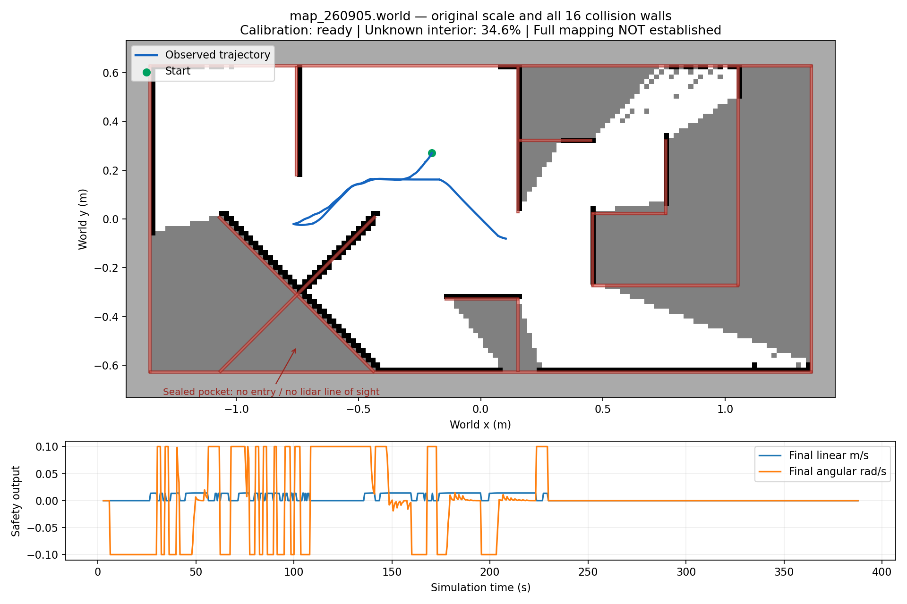

# 원본 월드 Gazebo 재검증 — HOLD

`map/map_260905.world` 원본 축척과 충돌 벽 16개를 유지했다. 원본 SHA-256은 `8475464857322d71f6e492171419bf285e7bd034089b90ad59d6f106b0941072`다. 제품 소스는 `cca1714`, 검증 도구 보완 내용은 이 문서와 같은 커밋에 있다. ROS domain 227 / Gazebo partition `pinky_calmap227`에서 실행했으며 실물 로봇에는 명령하지 않았다.

## 판정

- **전체 자율 매핑 HOLD:** velocity 실행은 600초 실시간 제한까지 관찰했다. 시뮬레이션 관찰 구간 384.853초, 누적 이동 1.702m, 표본 최소 중심-벽 거리 0.11458m(설정 반경 0.105m)다. `recovery_exhausted` 정지 후 남은 구역을 탐색하지 못했다. 원본 내부의 **34.648%가 미탐색**이다. 거리는 0.5초 표본 결과이며 연속 충돌 검증이 아니다.
- **원본 전체 100% 매핑은 구조적으로 불가능:** X자 대각 벽 두 개가 하단 외곽 벽과 만나 약 0.093024㎡의 삼각형 공간을 밀폐한다. 2mm 충돌 래스터에서 자유 공간은 두 연결 성분이며 밀폐 부분은 약 2.827%다. 시작점은 큰 연결 성분에 있고, 수평 라이다 높이는 벽보다 낮으므로 그 내부로 진입하거나 내부 바닥을 관측할 수 없다. 접근 가능한 영역 완료와 전체 월드 완료는 구분해야 한다. 이번 실행은 접근 가능한 영역 완료도 입증하지 못했다.
- **바퀴 구동계 HOLD:** 별도의 새 wheel 실행에서 저장 보정 인증서를 제거하고 처음부터 보정했다. `Round-trip leg stalled or timed out`으로 실패했다. 관찰 구간 14.571초, 누적 이동 0.01806m, ready=false이며 runner 종료 코드 1을 확인했다.
- 두 실행 모두 최종 `/cmd_vel` 발행자는 `safety_node` 하나였다.

velocity 실행은 이전 인증서를 재사용했다(`Saved calibration retained`). 따라서 새 보정의 처음부터 끝까지 성공한 증거가 아니다. 이 문제를 발견한 뒤 runner가 과거 인증서와 지도 품질 파일도 초기화하도록 수정했고, wheel 재실행에서 새 왕복 보정이 수행되는 것을 확인했다. velocity 프로세스 실행 중 제품 노드는 교체하지 않았다. 별도의 2초 읽기 전용 지도 스냅샷도 촬영했으며, `velocity/`의 최종 지도와 궤적은 원래 모니터가 종료할 때 저장한 전체 관찰 결과다.

## 화면과 데이터



흰색은 관측된 자유 공간, 회색은 미탐색, 검정은 SLAM 장애물, 붉은 선은 원본 월드 벽, 파란 선은 관측 궤적이다. 화살표는 밀폐 삼각형을 가리킨다. 이 그림은 실제 ROS `/map`과 `/odom` 기록으로 만든 결과 그림이며 Gazebo GUI 스크린샷은 아니다. GUI는 실행했지만 데스크톱 포커스/캡처 문제로 신뢰할 수 있는 전체 창 스크린샷을 확보하지 못했다.

`velocity/`와 `wheel/`에 지도 PGM/YAML/NPZ, 실행 manifest, 상태, 궤적과 로그를 보존했다. `track_map_audit.json`은 정적 지도 품질과 NPZ 해시를 담고, `track_result.json`은 실행 판정을 담는다. wheel의 `track_map_quality.json`은 지도 좌표계/시간 검사와 run_id를 함께 담는다. 초기 velocity 실행은 기존 모니터이므로 새 live 검사 필드가 없다.

## 검증 도구 보완과 재현

전체 월드 범위의 미탐색 비율, 방향을 반영한 벽 표면 검출률, 관측 통로 순도와 가짜 벽 비율을 계산한다. 전체 래스터 통과 기준은 미탐색 ≤1%, 모든 벽 표면 검출 ≥98%(5cm 허용), 알려진 통로 순도 ≥95%, 가짜 벽 <2%다. 밀폐 구역 때문에 원본 그대로 이 기준을 통과할 수 없다. 기준을 완화하거나 월드를 바꾸어 성공 처리하지 않았다.

```bash
RIG_PLANT=wheel bash tools/gz/run_track260905.sh
RIG_PLANT=velocity RIG_DURATION=1800 RIG_WALL_TIMEOUT=2400 RIG_REQUIRE_COMPLETE=1 bash tools/gz/run_track260905.sh
python3 -m tools.gz.track_map_audit /tmp/pinky-calmap227
python3 tools/gz/report_track_run.py /tmp/pinky-calmap227
```

독립 정적 감사 결과는 `track_map_audit.json`에 저장해 live 품질 증거를 덮어쓰지 않는다. 지도 frame, 원점 quaternion, timestamp가 유효해야 live 완료가 성립한다. `RIG_REQUIRE_COMPLETE=1`은 부분 지도나 live 검사 실패를 비정상 종료로 처리한다. 기본 모드는 종전의 제한 시간 관찰 용도를 유지한다.

WSL ROS 2 Jazzy에서 `python3 -m pytest test/ -q`: **326 passed**. 대시보드 Node 검사 **22 passed**. 별도 코드 리뷰에서 검증 도구와 HOLD 증거 커밋을 막는 문제는 없었다.

Gazebo GPU LiDAR와 GT odometry를 사용하며 scan matching은 꺼져 있다. IMU는 GT 기반, US는 LiDAR 기반, IR/카메라는 합성 입력이다. velocity 모델은 바퀴/마찰 검증을 제공하지 않는다. 따라서 이번 결과는 실물 동작, 독립 센서 보정, 바퀴 물리 또는 전체 매핑 성공의 증거가 아니다.
